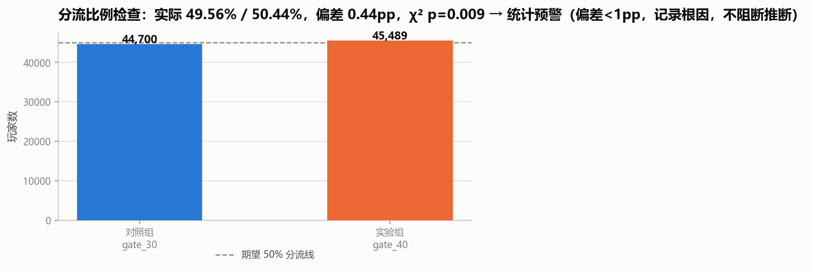
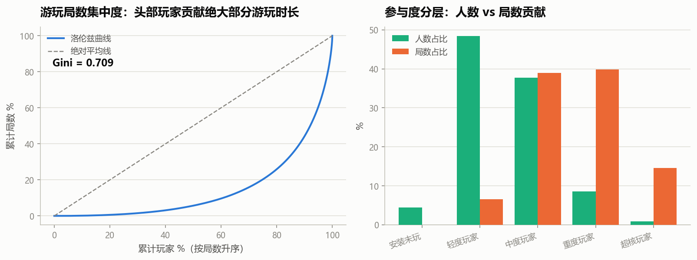
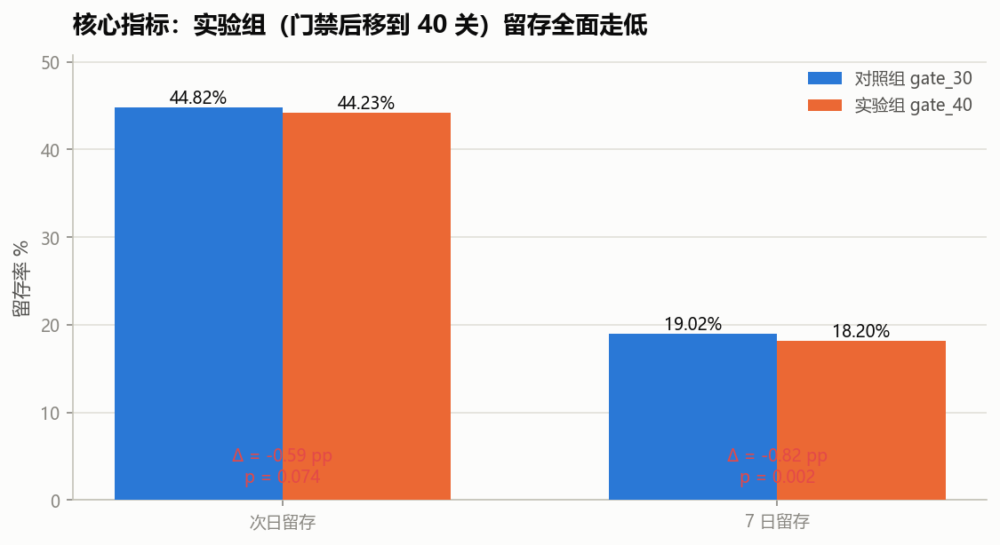
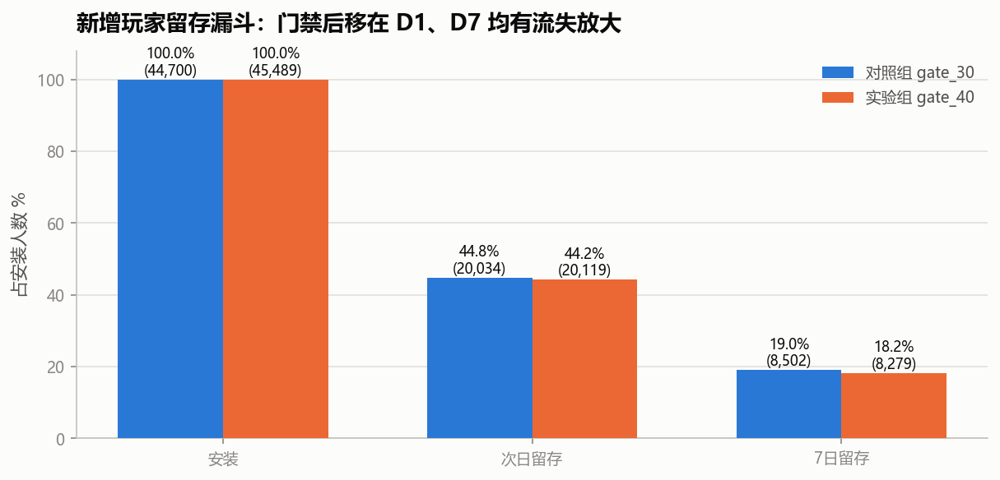
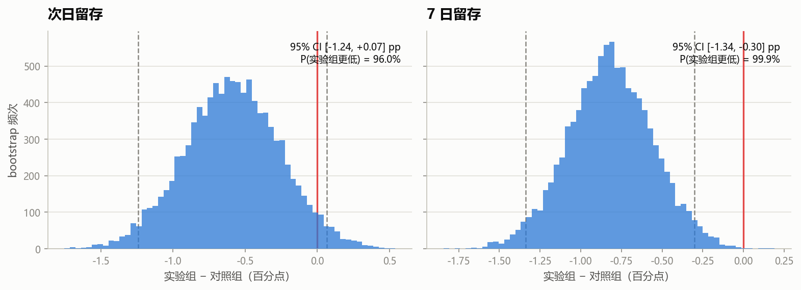
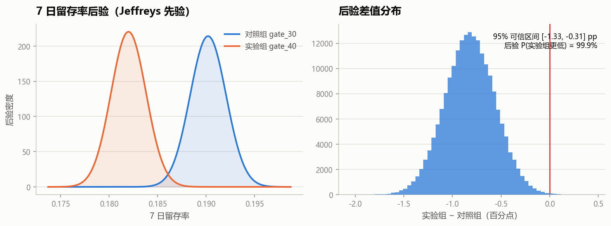
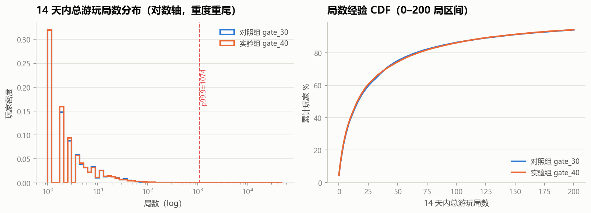
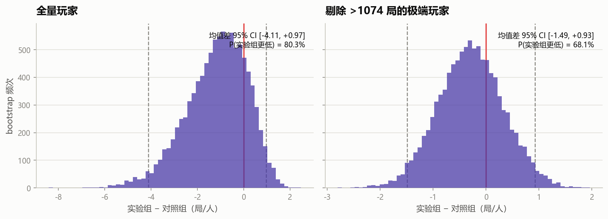
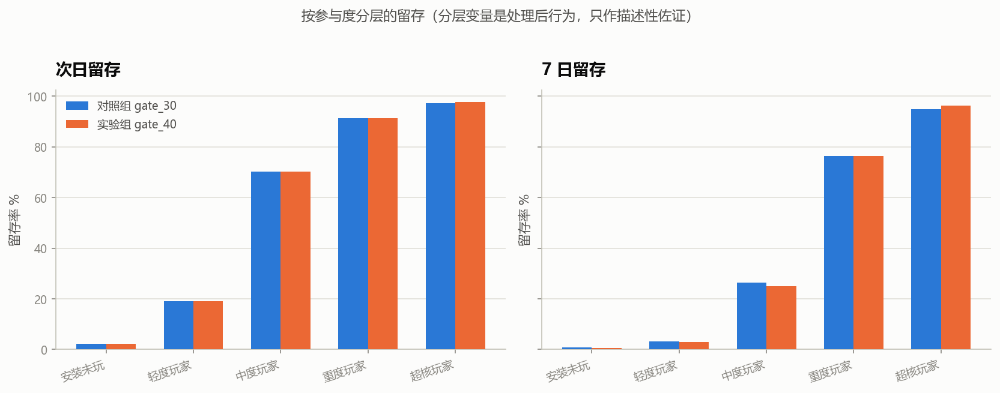
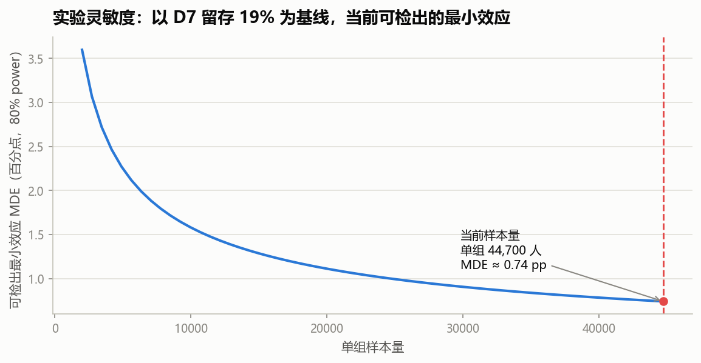

# 《Cookie Cats》门禁位置 A/B 实验分析报告

> 真实数据集（Tactile Entertainment 出品三消手游 Cookie Cats 的线上 A/B 实验，
> 共 90,189 名玩家）。数据来源：[Kaggle 公开数据集](https://www.kaggle.com/datasets/mursideyarkin/mobile-games-ab-testing-cookie-cats)，
> 原始文件 sha256 `5ab54d761fbddcd5…`，可由 `python -m src.download_data` 复现下载。

## 1. 业务背景与实验假设

- Cookie Cats 在关卡之间设置"门禁(Gate)"：玩家到门禁后需等待冷却或求助好友才能继续，
  作用是**拉长游戏节奏、制造社交触达，并把"跳过等待"做成付费点**。
- 实验把门禁从**第 30 关后移到第 40 关**：`gate_30` 为对照组（旧策略），
  `gate_40` 为实验组（新策略），按玩家随机分流，观察窗为安装后 14 天。
- 业务假设：让玩家更早地"无摩擦"连续游玩，可能提高沉浸度与早期留存；
  但门禁后移也可能削弱节奏控制，反而让玩家更快耗尽内容而流失。
  数据将决定哪一种效应占主导。
- 决策指标：**次日留存、7 日留存**（越早期的留存变化越能预测长期价值）；
  护栏/参考指标：14 天总游玩局数。

## 2. 数据质量与分流健康度

| 检查项 | 结果 |
|---|---|
| 玩家总数 | 44,700（对照）/ 45,489（实验），合计 90,189 |
| userid 重复 / 缺失 | 0 / 0 |
| 分流比例 SRM（χ²；阻断线 p<0.005 或偏差>1pp） | 实际 49.56% / 50.44%，偏差 0.44pp，p = 0.009 → 预警级：大样本下 1pp 以内的轻微失衡，判为哈希分流抖动，不阻断推断 |
| 参与度极端值 | 全样本 p99.9 = 1074 局；最大 49854 局（著名异常账号，疑似脚本/测试号） |

处理原则：不静默删除任何记录。主分析使用全量数据；对局数这种重尾指标，
额外做"剔除 p99.9 以上玩家"的敏感性分析，结论以两者是否一致为准。

**关于 SRM 的判读**：卡方 p=0.009 在 α=5% 下触发预警，但两组实际偏差仅
0.44 pp（49.56% vs
50.44%）。在 9 万样本下，分流哈希的轻微不均也会被检验为"显著"，
因此采用**双门槛**（p<0.005 或偏差>1pp 才阻断）；本实验未达阻断线，且分流发生在安装时刻、
统计的是全量玩家，不可能由"某组玩家流失后才埋点上报"造成，判定不影响后续推断。

## 3. 大盘画像：参与度高度集中

- 两组各约 4.5 万人，整体次日留存 **44.8%** 量级、
  7 日留存 **19.0%** 量级——三消手游典型的早期陡降曲线。
- 游玩局数 Gini 系数 **0.709**，参与度高度集中：

| tier     |     n | n_pct   | rounds_pct   |
|:---------|------:|:--------|:-------------|
| 安装未玩 |  3994 | 4.4%    | 0.0%         |
| 轻度玩家 | 43617 | 48.4%   | 6.6%         |
| 中度玩家 | 34021 | 37.7%   | 38.9%        |
| 重度玩家 |  7697 | 8.5%    | 39.9%        |
| 超核玩家 |   860 | 1.0%    | 14.6%        |

这一结构决定了运营策略的基调：**留存是基本盘（面向全体新手），
付费与活跃资源要接受头部集中的现实**（本数据集无收入字段，
只能用局数衡量参与度集中度）。

## 4. 核心结论：门禁后移到 40 关，留存全面走低

| 指标 | 对照组 gate_30 | 实验组 gate_40 | 绝对差 Δ | 双侧 z 检验 p | 频率派结论 |
|---|---|---|---|---|---|
| 次日留存 | 44.82% | 44.23% | -0.59 pp | 0.0744 | 不显著（α=5%），方向为负 |
| 7 日留存 | 19.02% | 18.20% | -0.82 pp | 0.0016 | 显著为负 |

- 7 日留存绝对下降 **0.82 pp**，相对降幅 **4.3%**，
  在 α=5% 下显著；次日留存方向同为负（-0.59 pp）但 p=0.074 未达显著。
- 越往后期差异越大，与"门禁被推迟后，缺少节奏断点的玩家更快耗尽内容"的机制一致。

### 4.1 稳健性印证：bootstrap 与贝叶斯两套语言

频率派 z 检验之外，用 10,000 次 bootstrap 与 Jeffreys 先验的 Beta-二项贝叶斯模型交叉验证：

| 指标 | bootstrap 95% CI | P(实验更低) | 贝叶斯 95% 可信区间 | 后验 P(实验更低) |
|---|---|---|---|---|
| 次日留存 | [-1.24, +0.07] pp | 96.0% | [-1.24, +0.06] pp | 96.3% |
| 7 日留存 | [-1.34, -0.30] pp | 99.9% | [-1.33, -0.31] pp | 99.9% |

三套方法结论一致：**7 日留存受损的证据充分**（区间不含 0、后验概率极高）；
次日留存方向一致但证据尚不足。

## 5. 护栏指标：游玩局数——一个被极端值支配的指标

- 局数分布极度重尾（大量玩家只玩几局，极少数玩家上千局），均值不具备代表性，
  主检验改用 Mann-Whitney U 秩检验：p = 0.0502，
  rank-biserial r = -0.0075
  （恰在显著边缘，
  但 r 的绝对值 <0.01，即使显著也不具备业务意义）。
- 均值差的 bootstrap 在**全量数据**下为 -4.11 ~ +0.97 局/人；
  **剔除 91 名 p99.9 以上的极端玩家后**变为 -1.49 ~ +0.93 局/人，
  P(实验更低) 从 80.3% 变为 68.1%。
- 结论：**局数指标对单个异常账号高度敏感，不能作为决策的唯一依据**；
  它与留存结论并不稳健，决策以留存为准。

## 6. 分层观察（描述性，非因果）

按全样本分位数把玩家分成五层（阈值 18/140/499 局），
两组在各层上的留存对比如下。需要特别说明：**参与度分层是处理后变量
（实验分配本身会影响游玩局数），分层内的对比不能解释为因果效应**，
这里仅用于观察负向效应是否集中在某类玩家。

## 7. 实验灵敏度复盘

以对照组 7 日留存 19.0% 为基线、α=5%、power=80%：

- 当前单组 44,700 人，可稳定检出约 **0.74 pp** 的留存变化；
  实际观测到的 D7 效应为 -0.82 pp，大于该灵敏度边界；
- 若要把检测精度提升到 0.5 pp，需单组约 9.8 万人；
  0.3 pp 需约 27.0 万人——
  这解释了为什么 D1 的小效应（-0.59 pp）未能显著：**样本量对更小的效应不具备功效**，
  "不显著"不等于"没有影响"。

## 8. 业务决策与建议

1. **门禁不要后移到第 40 关，维持/回退到第 30 关。**
   后移使 7 日留存显著下降 0.82 pp（相对 4.3%）。
   按 9 万样本推算，相当于观察窗内每 10 万新增多流失约 820 名 7 日活用户；
   留存是 LTV 的先行指标，长期收入损失会被放大。
2. **留存与商业化存在权衡，需补收入数据再最终拍板。**
   门禁本身是付费点（等待可被付费跳过），门禁后移可能改变付费节奏。
   本数据集无收入字段，无法衡量这一对冲项；上线/回滚决策应把 ARPU、首充率纳入同一实验。
3. **后续实验设计建议：**
   - 主指标 D7 留存 + 护栏 D1、局数、崩溃率；新增**收入/付费**作为共同主指标；
   - 按 0.5 pp 的 MDE 反推样本量（单组 9.8 万人），
     延长观察窗至 D14/D30 留存并做**新奇效应**监控（周度序列）；
   - 可进一步测试"门禁位置 25/30/35"的多臂实验，而非只在 30 与 40 之间二选一；
   - 上线前做 SRM 与埋点监控，局数类重尾指标固定使用秩检验/分位数 + 敏感性分析。

## 9. 方法与口径附录

- **两比例 z 检验**：合并标准误；置信区间用非合并 Wald 区间。
- **Bootstrap**：组内重采样 10,000 次（留存率用同分布的二项抽样加速），
  报告百分位置信区间与 P(实验更低)。
- **贝叶斯**：Jeffreys 先验 Beta(1/2,1/2)，20 万次蒙特卡洛，
  报告 95% 可信区间与后验概率。
- **Mann-Whitney U**：双侧秩检验，效应量 rank-biserial correlation。
- **SRM**：卡方拟合优度 + 1pp 实际偏差双门槛（p<0.005 或偏差>1pp 才阻断），
  避免超大样本下把哈希抖动误判为实验事故。
- **功效**：两比例等组样本量公式，MDE 曲线由二分法反解。
- 多重比较：D1/D7 两个主指标同时为负且 D7 在 Bonferroni 校正（α=2.5%）下仍显著，
  结论不依赖"凑显著性"。
- 全部结论可由 `python main.py` 一键复现（固定随机种子 20260919）。
